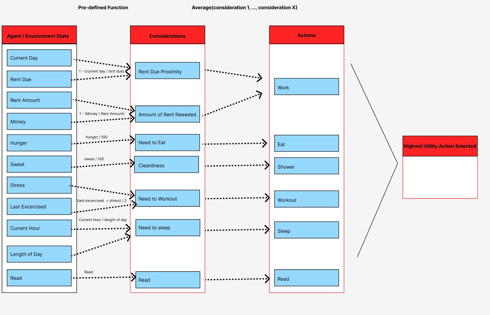
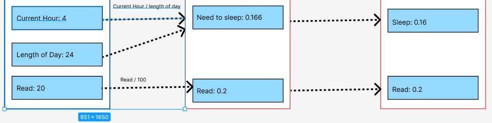
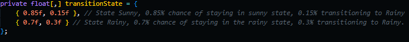

# Determining Agent Behavior with Utility Functions
The point of this project was to understand how Utility AI works. I have placed an Agent (or NPC) in a scene (his apartment) and used Utility AI to model his behavior. 
Performing different actions around his apartment like sleeping, eating, or watching tv. 

# How does Utility AI work?
In it's simplest form numerous actions like "Eating" are defined by it's various considerations (i.e. Am I hungry? Do I have food?, etc). All actions and their considerations are then scored based on the utility (or value) they provided to the agent in that given time (calculations must be done during run-time). The action that provides the most value/utility is then selected.

Scoring can be done through the use of functions/formulas. For simplicity the majority of considerations I defined use Unity's built in AnimationCurve to define a function. To properly compare each consideration, all scores are
normalized between 0 and 1.

###### Why must calculations be done during run-time?

In order for the agents behavior to be accurate and believable, they must take in real-time information in the environment and respond accordingly. For example, if a guard is on his lunch break and the player steps in front of his POV, he needs to response instantly and stop eating to attack the player. 

# Utility AI Breakdown

Here is a generalized breakdown of how the agent / environment stats get converted into considerations / actions:

​				*Note some information is abstracted. This is just a general flow.

An example with numbers thrown in:

In the above case, the action "Read" would be selected because it's overall utility is higher.

# Weather System
The weather system is very basic, just transitioning between two states: Sunny and Rainy. I've implemented a Markov Model to handle transitions.

Matrix:

Diagram:

